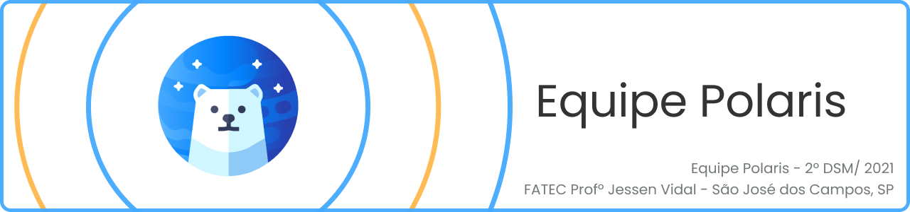
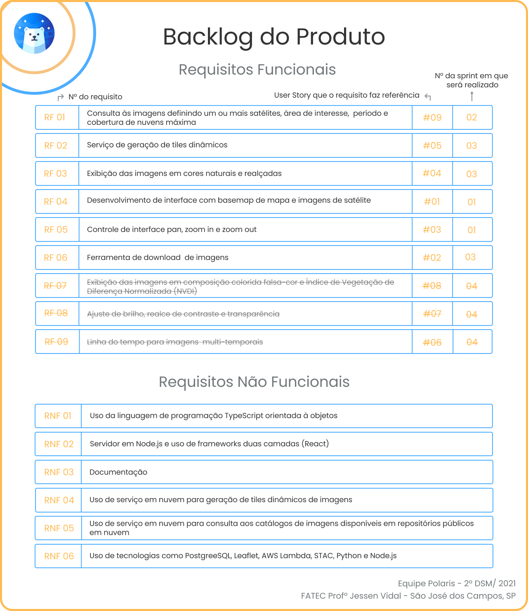
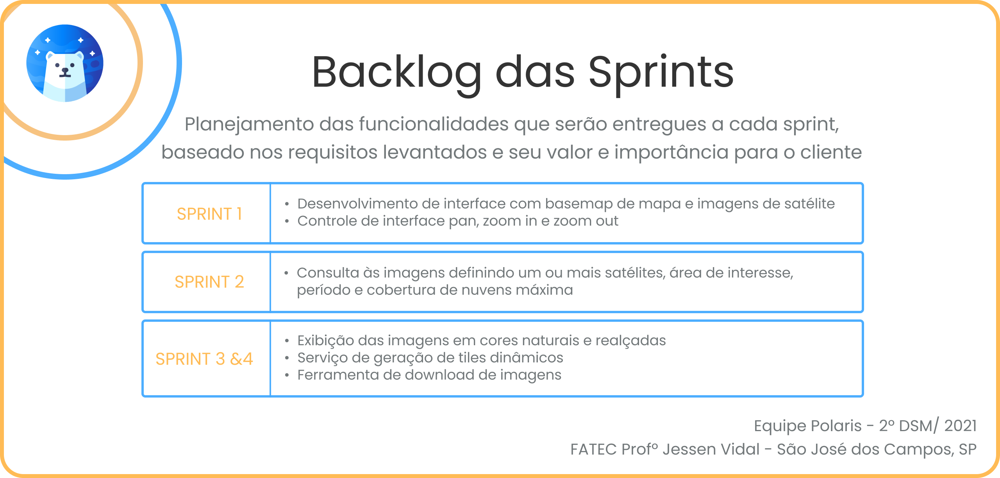
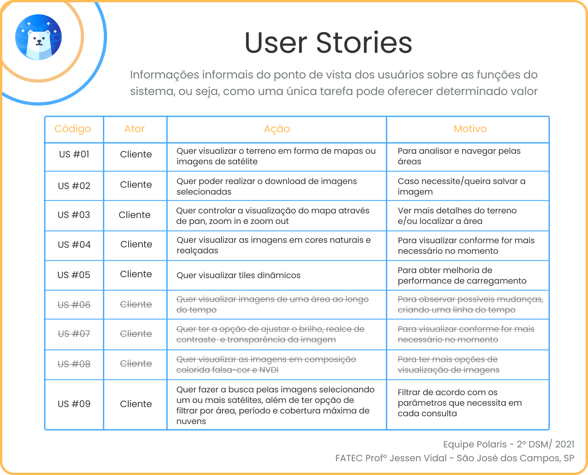

 

 

    <a href="#sobre">Sobre</a>  |  
    <a href="#backlogs">Backlogs</a>  |  
    <a href="#user-stories">User Stories</a>  |  
    <a href="#prototipo">Protótipo</a>  |  
    <a href="#tecnologias">Tecnologias</a>  |  
    <a href="#equipe">Equipe</a>  |  
    <a href="#final">Apresentação Final</a>  |  
    <a href="#licenca">Licença</a>

   

## :bookmark_tabs: Sobre o projeto

A partir da apresentação do desafio pela empresa parceira, a solução desenvolvida se configura em um site para consumo de imagens de satélites em repositórios em nuvem, permitindo a manipulação, visualização e download dessas imagens, proporcionando sua análise e facilitando sua obtenção de forma fácil e rápida.

> _Projeto baseado na metodologia ágil SCRUM, procurando desenvolver a Proatividade, Autonomia, Colaboração e Entrega de Resultados dos envolvidos_

:pushpin: Status do Projeto: **Em andamento** :construction:

### Entregas de Sprints

Cada entrega foi realizada a partir da criação de uma **tag** em cada repositório (API e web), além da criação de uma branch neste repositório com um relatório completo de tudo o que foi desenvolvido. Observe a relação a seguir:
| Sprint | Previsão | Status | Histórico |
|:------:|:----------:|:-------------|:-------------------------------------------------:|
| 01 | 19/09/2021 | :heavy_check_mark: Concluída | [ver relatório](https://github.com/Equipe-Polaris-DSM-2021/docs/tree/sprint-01) |
| 02 | 10/10/2021 | :heavy_check_mark: Concluída | [ver relatório](https://github.com/Equipe-Polaris-DSM-2021/docs/tree/sprint-02) |
| 03 | 07/11/2021 | :white_check_mark: Em andamento | -- |
| 04 | 28/11/2021 | Não iniciada | -- |

→ [Voltar ao topo](#topo)

## :dart: Backlog

 

 

→ [Voltar ao topo](#topo)

## :mag: User Stories

 

→ [Voltar ao topo](#topo)

## :desktop_computer: Protótipo

Como parte do planejamento do projeto foram criados wireframes e mockups para idealização do layout, que, ao ser validado pelo cliente, foi aplicado em um protótipo construído em React, possibilitando a interação do usuário com a interface, porém sem a utilização das funcionalidades reais. O resultado pode ser conferido pela demonstração abaixo:

 

→ [Voltar ao topo](#topo)

## 🛠️ Tecnologias

As seguintes ferramentas, linguagens, bibliotecas e tecnologias foram usadas na construção do projeto:

 

 
 	
 
 
   

 
 
 
 
     
→ [Voltar ao topo](#topo)

## :busts_in_silhouette: Equipe

|    Função     | Nome                                  |                                                                                                                                                      LinkedIn & GitHub                                                                                                                                                      |
| :-----------: | :------------------------------------ | :-------------------------------------------------------------------------------------------------------------------------------------------------------------------------------------------------------------------------------------------------------------------------------------------------------------------------: |
| Product Owner | Monique Carniello                     |            |
| Scrum Master  | Maria Gabriela Garcia dos Santos Reis |             |
|   Dev Team    | Caio Vitor Dias                       |                    |
|   Dev Team    | Gabriel Camargo Leite                 |       |
|   Dev Team    | Giovana Thaís de Oliveira Silva       |                        |
|   Dev Team    | João Marcos Oliveira Santos           |                     |
|   Dev Team    | Otávio Ferraroni Gonçalves Pane       |                 |
|   Dev Team    | Thiago Henrique Ferreira              |   |

→ [Voltar ao topo](#topo)

## :clapper: Apresentação Final do Projeto

Em breve...

## :page_with_curl: Licença

Esse projeto está sob a licença MIT. Veja o arquivo [LICENSE](LICENSE) para mais detalhes.

→ [Voltar ao topo](#topo)
