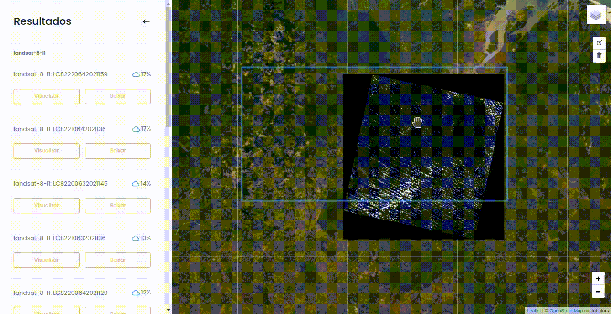
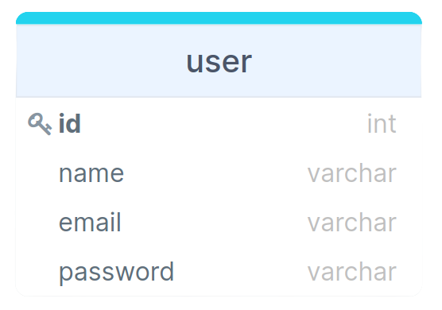

<h1 align="center">Sprint 4: 08/11/2021 a 28/11/2021</h1>

    <a href="#objetivos">Objetivos da sprint</a> &nbsp |&nbsp &nbsp
    <a href="#entregas">Entregas</a> &nbsp |&nbsp &nbsp
    <a href="#metricas">Métricas do time</a> &nbsp |&nbsp &nbsp
    <a href="#links">Links úteis</a>

Na quarta e última sprint a equipe deu atenção aos requisitos restantes do projeto, que foram renegociados junto ao cliente por conta de sua complexidade, além de focar também na entrega de requisitos desejados pela própria instituição de ensino, como a implementação e uso de banco de dados onde, em geral, foram abordadas tarefas de front-end (para implementação do banco de dados a partir de um cadastro de usuários e o download das imagens), e tarefas de back-end, concentradas em pesquisas e testes com geração de tiles dinâmicos e estáticos, aplicação de filtros de cor em imagens e o download das bandas de cada imagem separadamente.

## :dart: Objetivos da Sprint

Os requisitos abrangidos por essa sprint são os mesmos abrangidos pela terceira sprint, devido a complexidade e detalhes envolvidos:

- **RF 02:** Serviço de geração de tiles dinâmicos
- **RF 03:** Exibição das imagens em cores naturais e realçadas
- **RF 06:** Ferramenta de download de imagens
- **Requisito FATEC:** criação e aplicação de banco de dados

## :heavy_check_mark: Entregas

Assim como observado na terceira sprint, as dificuldades do time quanto a questões técnicas e relacionadas ao tempo disponível para o projeto permaneceram, resultando no replanejamento do backlog do produto junto ao cliente, já ciente das possibilidades de entrega de cada requisito e suas condições. Dito isso, nos tópicos abaixo são abordadas as evoluções realizadas em cada requisito.

### RF 02: Serviço de geração de tiles dinâmicos

Com a apresentação ao fim da sprint 3, foi confirmado que a utilização de tiles estáticos seria permitida e até mesmo adequada para implementação no projeto, dessa forma, nesta sprint foram aplicados esforços para novos testes e utilização de outras ferramentas e tecnologias que possibilitariam a geração destes tiles e uma possível integração ao projeto, porém este cenário se tranformou apenas na situação ideal, onde a real apresentada foi constituída apenas dos testes iniciais, sem a conclusão com integração ao projeto, fixando-se como a geração de tiles para uma única imagem.
 

### RF 03: Exibição das imagens em cores naturais e realçadas

Após a criação de muitos testes e pesquisas, foi alcançado o resultado esperado, porém aplicado a uma única imagem, capturada pelo satélite Landsat 8, e utilizando filtros específicos, ainda com limitações de processamento e tempo, portanto, da forma que realizada tal tarefa, a demora para a geração de uma visualização do filtro na imagem utilizando o Jupyter Notebook fez com que sua integração ao projeto como um todo se tornasse não recomendável, onde a finalização da última sprint não trouxe melhores práticas, outras estratégias ou mesmo uma forma de integração viável, ocasionando uma entrega incompleta deste requisito.

### RF 06: Ferramenta de download de imagens

Também na apresentação da terceira sprint foi acordado com o cliente que o download das imagens se daria pela opção de baixar as bandas de cada imagem separadamente, onde este requisito foi iniciado na sprint 3, com a criação da interface, e finalizado na sprint 4, com a implementação da lógica que permite o download das bandas disponíveis. Na demonstração abaixo é possível observar o modal criado na sprint passada juntamente com o funcionamento do requisito.

### Requisito FATEC: Criação e aplicação de banco de dados

Atendendo ao desejo de se implementar um banco de dados no projeto, foi criado um CRUD de usuário, o qual conta com um cadastro, login e logout, além da possibilidade de alteração de dados e exclusão de conta. Nas imagens abaixo é possível observar o Modelo Lógico da tabela de usuário bem como um GIF demonstrando as funcionalidades relacionadas a ela.

### Requisitos não funcionais

Como sendo a última sprint, foram previstos as entregas finais de alguns requisitos não funcionais, como o caso da documentação, que seguiu um padrão de monografia, em PDF, e alguns outros requisitos, sendo eles:

| Requisito Não Funcional                                                                                      | Atendimento                                                                                                                                                                                  |
| :----------------------------------------------------------------------------------------------------------- | :------------------------------------------------------------------------------------------------------------------------------------------------------------------------------------------- |
| Uso da linguagem de programação TypeScript orientada à objetos                                               | Aplicada tanto ao back-end quanto ao front-end através de classes e objetos                                                                                                                  |
| Servidor em Node.js e uso de frameworks duas camadas, como React                                             | Utilizado Node.js como servidor e React no front-end                                                                                                                                         |
| Uso de serviço em nuvem para geração de tiles dinâmicos de imagens                                           | Pendente                                                                                                                                                                                     |
| Uso de serviço em nuvem para consulta aos catálogos de imagens disponíveis em repositórios públicos em nuvem | Utilização da API externa para manipulação das imagens capturadas pelo satélite Landsat 8 e Sentinel 2                                                                                        |
| Uso de tecnologias como PostgreeSQL, Leaflet, AWS Lambda, Python e Node.js                                   | Utilizadas na criação do banco de dados (PostgreeSQL), interface de mapa (Leaflet), em testes e aplicação de filtros nas imagens (Python) além do back-end do site, com TypeScript (Node.js) |

→ [Voltar ao topo](#topo)

## :chart_with_upwards_trend: Métricas do time

Ainda com a divisão da equipe entre times de front-end e backend, o time front focou nos requisitos de download das imagens e criação das telas para o cadastro de usuários enquanto o de back-end teve foco nos requisitos de geração de tiles e exibição das imagens com filtros, além da implementação do banco de dados. O acompanhamento dessas atividades, de responsabilidade da Scrum Master, se encontra na imagem adiante, constituída pelo gráfico Burndown gerado pela equipe (onde o eixo X são os dias trabalhados na sprint e os valores do eixo Y representam as entregas e esforços realizados com o passar do tempo), incluindo as atividades desenvolvidas e seus responsáveis.

→ [Voltar ao topo](#topo)

## :link: Links úteis

- Documentação em PDF, estilo monografia (requisito não funcional do projeto): [clique aqui](./documentacao.pdf)
- Repositórios de códigos: [Portal Web](https://github.com/Equipe-Polaris-DSM-2021/web), [API](https://github.com/Equipe-Polaris-DSM-2021/api)
- Tags geradas em cada repositório que simbolizam o fim da 4ª sprint: [API](https://github.com/Equipe-Polaris-DSM-2021/api/releases/tag/sprint-04), [Portal Web](https://github.com/Equipe-Polaris-DSM-2021/web/releases/tag/sprint-04)
