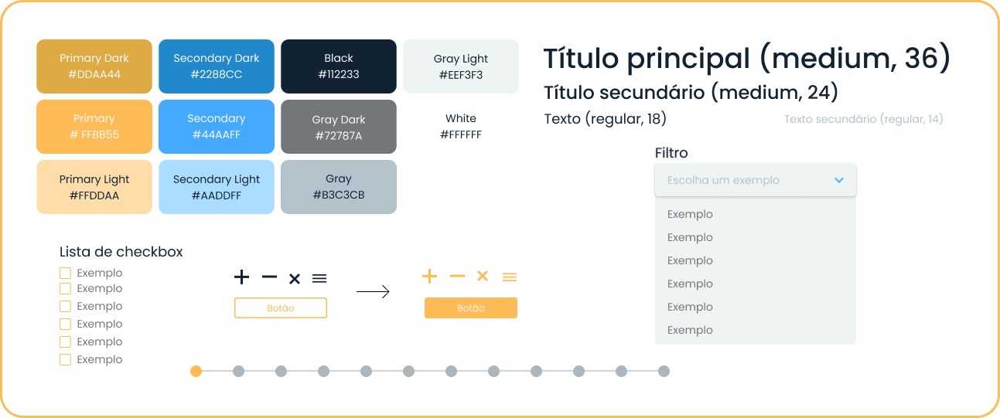

<h1 align="center">Sprint 1: 30/08/2021 a 19/09/2021</h1>

    <a href="#objetivos">Objetivos da sprint</a>  |   
    <a href="#entregas">Entregas</a>  |  
    <a href="#prototipo">Demonstração</a>

O projeto se baseia na construção de um site capaz de consumir imagens de satélite armazenadas em repositórios públicos, permitindo sua visualização e manipulação, bem como o download com aplicação de determinados filtros disponíveis, pensando nisso a primeira sprint se deu com a aplicação de horas massivamente em pesquisas sobre o contexto, técnicas e tecnologias bem como foi aplicado esforços para levantamento e refinamento de requisitos, gerando backlogs ordanados e priorizados a partir da visão do cliente, e, para a entrega, um protótipo visando validar as expectativas entre todas as partes envolvidas no projeto, logo, cliente, time e instituição de ensino.

    
## :dart: Objetivos da Sprint
Os requisitos (tanto do cliente como da instituição de ensino) abrangidos por essa sprint são:
- RF 04: Desenvolvimento de interface com basemap de mapa e imagens de satélite
- RF 05: Controle de interface pan, zoom in e zoom out

        
## :heavy_check_mark: Entregas

### Levantamento de requisitos

A P.O. manteve a comunicação direta com o cliente visando extrair seus desejos e necessidades para o produto em desenvolvimento, levando à documentação de todo e qualquer requisito levantado, construindo em cima deles User Stories e classificando-os em requisitos funcionais e não funcionais (tabelas todas se encontram no tópico **Backlogs** do readme principal deste repositório, ou por meio [deste link](https://github.com/Equipe-Polaris-DSM-2021/docs#backlogs)) Além da organização dos requisitos em cada sprint, gerando o Sprint Backlog.

### Elaboração do wireframe/mockup (identidade visual e design do sistema)

Como tal projeto é uma proposta de solução para o desafio oferecido pelo cliente, foram adotadas como cores principais as cores predominantes da empresa, o laranja e o branco, além de uma cor análoga para contraste, o azul. Já para a tipografia foi escolhida a família de fontes “Poppins”, que passa a sensação do moderno e simples, já que se constitui de uma fonte sem serifa e com diversas variações. Para visualizar as variações selecionadas, bem como o tamanho e cores aplicadas, além da própria paleta de cores e alguns componentes padronizados, observe a imagem a seguir:

Depois de várias pesquisas em busca de referências, produtos semelhantes, estudo das funcionalidades e preferências do cliente foi idealizado um layout para as telas iniciais, que, mais a frente, se transformaria em um protótipo codificado em React, visando dar ao usuário um feedback visual antes mesmo das funcionalidades reais serem desenvolvidas, onde o mockup foi feito utilizando a ferramenta gratuita Figma e validado com o cliente.

→ [Voltar ao topo](#topo)

    
## :desktop_computer: Desenvolvimento do protótipo
Validado o mockup com o cliente, iniciaram os trabalhos para transformá-lo em um protótipo, dando a experiência e interação ao usuário como se o mesmo tivesse em mãos o produto final. Para isso, foi utilizado o React, confeccionando os componentes e criando as telas e servidor que iriam provê-las e consumir a A.P.I que ainda será construída a partir da próxima sprint. Confira abaixo uma demonstração:
    

    
Com este protótipo são finalizados os dois requisitos acordados para esta sprint, onde sua descrição pode ser checada a seguir:

#### RF 04: Desenvolvimento de interface com basemap de mapa e imagens de satélite

A User Story deste requisito é “O usuário quer visualizar o terreno em forma de mapas ou imagens de satélite para analisar e navegar pelas áreas“, onde tal funcionalidade foi concluída com a criação do protótipo do produto, que provê a possibilidade de alternar entre visualizar o mapa a partir de um basemap ou utilizando as imagens de satélite, porém esta função só estará 100% completa a partir do consumo da A.P.I. que ainda será criada, a qual proverá as imagens de satélite que serão disponibilizadas para visualização na interface.

#### RF 05: Controle de interface pan, zoom in e zoom out

A User Story deste requisito é “O usuário quer controlar a visualização do mapa através de pan, zoom in e zoom out para ver mais detalhes do terreno e/ou localizar a área”, onde o objetivo era criar uma maneira de manipulação que permitiria ao usuário realizar estas ações na interface de mapa. Tal funcionalidade foi implementada através do Leaflet, que integra tais ações nativamente ao mapa gerado, mostrando-se de fácil manutenção e manipulação.

#### Tecnologias escolhidas

A entrega da primeira sprint foi desenvolvida utilizando-se as seguintes tecnologias:

- **HTML:** linguagem de marcação para criação de páginas web;
- **CSS:** linguagem de estilização (aplicação de estilo à páginas web);
- **React.js:** biblioteca JavaScript que permite a criação de interfaces gráficas com a sintaxe JSX;
- **TypeScript:** superset de JavaScript que permite o uso de tipagem e aplicação de conceitos do paradigma da Programação Orientada a Objetos;
- **Leaflet:** biblioteca JavaScript usada para construir aplicativos que envolvam mapas;
- **Netlify:** serviço em nuvem que oferece hospedagem para aplicativos da web e sites estáticos

Para acessar o site do protótipo, acesse: [https://polaris-fatec.netlify.app/](https://polaris-fatec.netlify.app/), já para acessar a documentação em PDF, estilo monografia, desenvolvida nesta sprint (onde a documentação se enquadra como um requisito não funcional do projeto), acesse [este link](./documentacao.pdf)

→ [Voltar ao topo](#topo)
