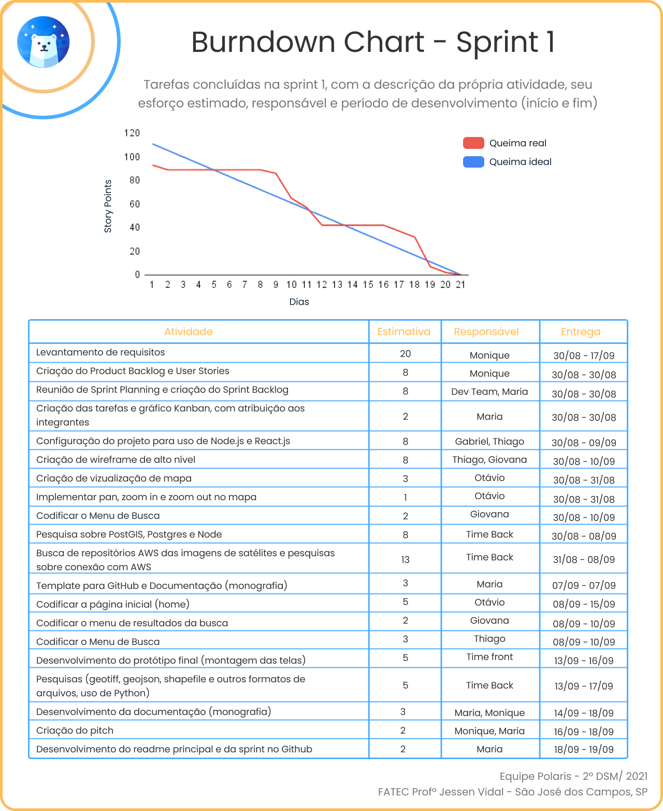

<h1 align="center">Sprint 3: 18/10/2021 a 07/11/2021</h1>

    <a href="#objetivos">Objetivos da sprint</a> &nbsp |&nbsp &nbsp
    <a href="#entregas">Entregas</a> &nbsp |&nbsp &nbsp
    <a href="#metricas">Métricas do time</a> &nbsp |&nbsp &nbsp
    <a href="#links">Links úteis</a>

Na terceira sprint a equipe focou nos requisitos mais valiosos para o cliente, como geração de tiles dinâmicos e a exibição das imagens em cores naturais e realçadas, além de trabalhar no iníco do requisito de download das imagens. Com a apresentação do pitch da 2ª sprint, também foram apontadas melhorias a serem feitas, como o uso da própria imagem na visualização do mapa e permanecer com a delimitação da área de interesse durante toda a visualização das imagens, onde este último pedido foi concluído com sucesso nesta sprint, enquanto que o primeiro pedido está avaliado para a quarta sprint.

    
## :dart: Objetivos da Sprint
Os requisitos abrangidos por essa sprint são:
- RF 02: Serviço de geração de tiles dinâmicos
- RF 03: Exibição das imagens em cores naturais e realçadas
- RF 06: Ferramenta de download de imagens

        
## :heavy_check_mark: Entregas
Durante toda a terceira sprint foram observadas dificuldades do time quanto a questões de conhecimento e tempo para execução do projeto, o que provocou um replanejamento do backlog junto ao cliente e a busca por profissionais da área, ou áreas relacionadas, fora da faculdade, porém, nenhum resultado palpável que poderia ser aplicado ao projeto foi obtido com essa estratégia, caracterizando este sprint como majoritariamente de pesquisas, busca de conhecimento e testes.
    
### RF 02: Serviço de geração de tiles dinâmicos
Um dos requisitos mais valiosos para o cliente, que consiste em usar tiles dinâmicos durante a visualização das imagens no mapa. Tal funcionalidade era considerada muito avançada pelos integrantes do grupo, que tiveram muita dificuldade em aplicar esforços em pesquisas, conversas com professores e outros profissionais além de implementar pequenas provas de conceito para afirmar o conhecimento que estavam adquirindo a passos lentos, até que, enfim, algum mínimo resultado foi alcançado com a geração de um tile caracterizado como "estático" por um professor atuante na área, e então o foco dos últimos dias de sprint foi centrado em tentar obter mais resultados desta tática, afim de entender melhor o conceito de tiles, diferenças entre tile estático e dinâmico e como poderia ser integrado ao projeto para que satisfizesse o requisito do cliente. Observe um resultado obtido de um dos testes realizados:
	

	
### RF 03: Exibição das imagens em cores naturais e realçadas
Foram pesquisadas muitas tecnologias, ferramentas e bibliotecas para aplicação de filtros nas imagens, porém, também com muita dificuldade, o time back-end conseguiu a aplicação de filtros específicos em uma única imagem, mas ainda com alguns poréns, como a necessidade de uma máquina potente o suficiente para todo o processamento e o uso da linguagem Python, utilizando o Jupyter Notebook, sem muita clareza no caminho a se seguir para integração com o projeto como um todo para possibilitar a aplicação em todas as imagens disponíveis. Veja na demonstração abaixo o resultado da aplicação de um filtro em uma imagem obtida do satélite Landsat 8.
	

  Imagem sem filtro (banda azul original)
  

  Imagem com filtro (filtro: equalize_histogram)
  

	
	
### RF 06: Ferramenta de download de imagens
Como o acordado com o cliente, este requisito foi dividido entre a sprint 3 e 4, onde neste sprint seria iniciado a parte visual do requisito, como construção do modal e validação do mesmo pela empresa parceira, bem como testes e pesquisas para possibilitar o download das imagens futuramente. No GIF a seguir é possível observar a criação do modal inicial já integrado ao projeto, possibilitando o download de uma banda (arquivo .tiff) de cada imagem, mas que na próoxima sprint ainda será refinado e usado para os fins requeridos.
	

	
	
→ [Voltar ao topo](#topo)
    

    
## :chart_with_upwards_trend: Métricas do time
Em prol de um melhor aproveitamento das habilidades de cada integrante, a divisão do time entre as frentes de frontend e backend permaneceu, onde o time front ficou responsável pela criação do modal de download e pesquisas relacionadas a este requisito enquanto o time back focou em pesquisas e testes com os requisitos de tiles dinâmicos e aplicação de filtros nas imagens. O acompanhamento de atividades, de responsabilidade da Scrum Master, se encontra na imagem adiante, que contém o gráfico Burndown gerado pela equipe (onde o eixo X são os dias trabalhados na sprint e os valores do eixo Y representam as entregas e esforços realizados com o passar do tempo), incluindo as atividades desenvolvidas e seus responsáveis.
    

    
→ [Voltar ao topo](#topo)
    

    
## :link: Links úteis
- Documentação em PDF, estilo monografia (requisito não funcional do projeto): [clique aqui](./documentacao.pdf)
- Repositórios de códigos: [Portal Web](https://github.com/Equipe-Polaris-DSM-2021/web), [API](https://github.com/Equipe-Polaris-DSM-2021/api)
- Tags geradas em cada repositório que simbolizam o fim da 2ª sprint: [API](https://github.com/Equipe-Polaris-DSM-2021/api/releases/tag/sprint-03), [Portal Web](https://github.com/Equipe-Polaris-DSM-2021/web/releases/tag/sprint-03)
